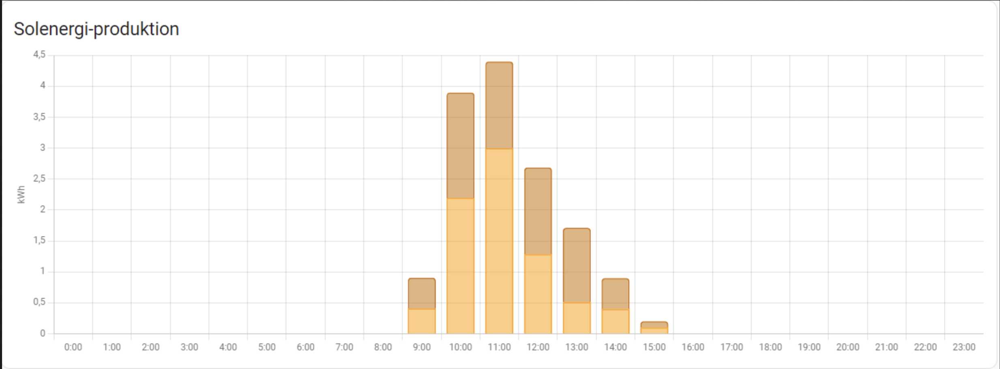
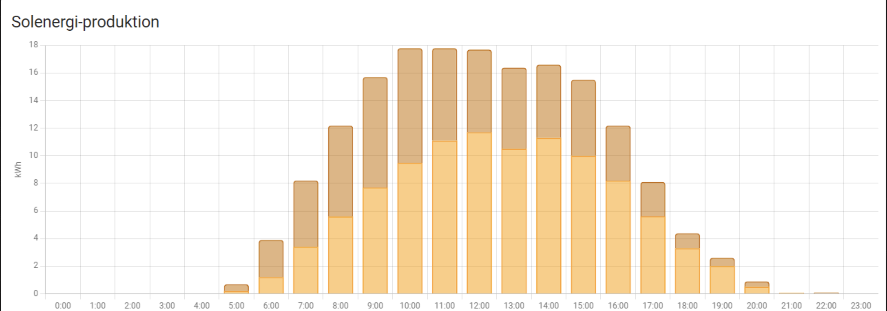
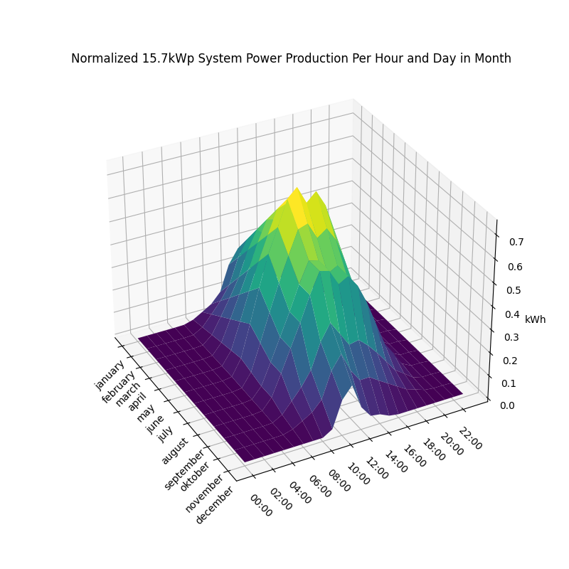

# Summary
This text summarizes the result from calculating the return of investment for installing solar panels in Sweden. Following this text, is a more detailed description how these number are derived. More tables for other power production and inverterd sizes can be found in the appending.

To get a better picture of your future system, run the [Selling Power](selling_power.ipynb) jupyter notebook.

Because the position of the solar panels are highly effect the power produced, the below tables give two examples of different systems that align in different cardinal direction. Remember that all values in this document are only examples and will differ in your specific setup. However, how much they differ is hard to predict. See the section of power production modelling for more details about the two systems.

The following assumptions/simpilifications has been made:
<ul>
    <li>Electric zone SE3</li>
    <li>Solar cells have a linear power production model between December and June</li>
    <li>All power is sold immediately, regardless of price. No power is stored and sold later at a better price.</li>
    <li>All power is sold, no power is used by the household.</li>
    <li>100% availability</li>
</ul>

                            System 1 Earnings (SEK) (10kWp, 8kW Inverter)
                           
|  Year|    Jan|   Feb|   Mar|   Apr|   May|   Jun|   Jul|   Aug|   Sep|   Oct|   Nov|   Dec|   SUM|
|------|------|------|------|------|------|------|------|------|------|------|------|------|------|
|  2016|  158.0| 141.4| 225.1| 283.4| 399.3| 728.0| 495.4| 451.2| 407.5| 297.3| 197.6|  53.6 | 3837.7|
|  2017|  150.0| 233.9| 331.4| 389.8| 519.8| 556.2| 533.9| 500.7| 516.9| 249.5| 151.0|  51.1 | 4184.0|
|  2018|  161.0| 295.0| 530.6| 561.3| 642.4| 929.2| 953.1| 841.5| 751.3| 377.6| 245.6|  86.2 | 6374.8|
|  2019|  280.3| 345.0| 461.9| 590.3| 682.7| 588.9| 644.1| 578.5| 529.4| 336.8| 212.4|  64.0 | 5314.2|
|  2020|  124.6| 163.0| 182.5| 149.4| 262.1| 651.9| 188.8| 616.8| 541.2| 218.7| 142.1|  63.3 | 3304.2|
|  2021|  262.8| 424.7| 447.9| 489.8| 804.2| 888.5|1099.4|1052.6|1464.4| 656.7| 489.4| 355.5 | 8435.8|
|  2022|  603.2| 661.5|1519.9|1344.9|1998.9|3007.9|1969.8|4282.3|3677.7| 792.0| 698.3| 492.6 |21049.0|
|  2023|  542.3| 665.5| 956.7| 935.3| 685.4|1057.6| 617.5| 555.5| 431.6| 340.9| 429.6| 146.7 | 7364.8|

The table above display example system 1 earnings in SEK when we apply our solar panel power production model to historical spot prices of electricity. Note that year 2022 stand out due to high electric prices, probably because the start of the Ukraine war.

                           System 2 Earnings (SEK) (10kWp, 8kW Inverter)
                          
|  Year|    Jan|   Feb|   Mar|   Apr|   May|   Jun|   Jul|   Aug|   Sep|   Oct|   Nov|   Dec|   SUM|
|------|------|------|------|------|------|------|------|------|------|------|------|------|------|
|  2016|  148.1| 130.9| 204.6| 257.0| 360.6| 651.8| 440.7| 402.5| 367.2| 272.3| 185.8|  58.6 | 3480.3|
|  2017|  141.0| 214.8| 302.4| 354.1| 468.0| 497.9| 476.7| 451.7| 465.9| 229.8| 141.9|  55.7 | 3799.9|
|  2018|  151.2| 272.8| 490.1| 508.7| 579.1| 824.5| 848.2| 753.9| 677.0| 346.0| 230.8|  94.4 | 5776.5|
|  2019|  264.9| 316.1| 418.9| 533.4| 610.8| 522.9| 573.5| 520.2| 478.3| 308.4| 199.7|  69.8 | 4816.9|
|  2020|  117.0| 152.2| 168.9| 149.5| 247.6| 583.4| 166.5| 549.0| 495.7| 200.1| 129.2|  69.4 | 3028.5|
|  2021|  245.5| 401.7| 413.1| 462.5| 735.3| 787.9| 978.6| 943.3|1309.2| 600.3| 455.7| 386.0 | 7719.1|
|  2022|  558.4| 606.2|1455.8|1287.1|1863.5|2751.5|1739.5|3783.5|3332.2| 727.9| 648.3| 535.4 |19289.2|
|  2023|  502.4| 612.9| 883.9| 880.0| 673.2| 971.2| 563.8| 496.8| 400.4| 322.9| 400.1| 159.3 | 6866.8|

The table above display example system 2 earnings in SEK when we apply our solar panel power production model to historical spot prices of electricity. Note that year 2022 stand out due to high electric prices, probably because the start of the Ukraine war.

    System 1 Power Sold and Power Produced Overflow (kWh) (10kWp, 8kW Inverter)
    
|  Year|    Jan|   Feb|   Mar|   Apr|   May|   Jun|   Jul|   Aug|   Sep|   Oct|   Nov|   Dec|   SUM|
|------|------|------|------|------|------|------|------|------|------|------|------|------|------|
|2016|   465.3| 724.7|1084.0|1348.4|1702.7|1947.1|1702.7|1393.4|1348.4| 774.7| 450.3| 156.0 |13097.7|
|     |    0.0|   0.0|   0.0|   0.0|   0.0|   0.0|   0.0|   0.0|   0.0|   0.0|   0.0|   0.0 |0.0|
|2017|   465.3| 699.7|1084.0|1348.4|1702.7|1947.1|1702.7|1393.4|1348.4| 774.7| 450.3| 156.0 |13072.7|
|     |    0.0|   0.0|   0.0|   0.0|   0.0|   0.0|   0.0|   0.0|   0.0|   0.0|   0.0|   0.0 |0.0|
|2018|   465.3| 699.7|1084.0|1348.4|1702.7|1947.1|1702.7|1393.4|1348.4| 774.7| 450.3| 156.0 |13072.7|
|     |    0.0|   0.0|   0.0|   0.0|   0.0|   0.0|   0.0|   0.0|   0.0|   0.0|   0.0|   0.0 |0.0|
|2019|   465.3| 699.7|1084.0|1348.4|1702.7|1947.1|1702.7|1393.4|1348.4| 774.7| 450.3| 156.0 |13072.7|
|     |    0.0|   0.0|   0.0|   0.0|   0.0|   0.0|   0.0|   0.0|   0.0|   0.0|   0.0|   0.0 |0.0|
|2020|   465.3| 724.7|1084.0|1348.4|1702.7|1947.1|1702.7|1393.4|1348.4| 774.7| 450.3| 156.0 |13097.7|
|     |    0.0|   0.0|   0.0|   0.0|   0.0|   0.0|   0.0|   0.0|   0.0|   0.0|   0.0|   0.0 |0.0|
|2021|   465.3| 699.7|1084.0|1348.4|1702.7|1947.1|1702.7|1393.4|1348.4| 774.7| 450.3| 156.0 |13072.7|
|     |    0.0|   0.0|   0.0|   0.0|   0.0|   0.0|   0.0|   0.0|   0.0|   0.0|   0.0|   0.0 |0.0|
|2022|   465.3| 699.7|1084.0|1348.4|1702.7|1947.1|1702.7|1393.4|1348.4| 774.7| 450.3| 156.0 |13072.7|
|     |    0.0|   0.0|   0.0|   0.0|   0.0|   0.0|   0.0|   0.0|   0.0|   0.0|   0.0|   0.0 |0.0|
|2023|   465.3| 699.7|1084.0|1348.4|1702.7|1947.1|1702.7|1393.4|1348.4| 774.7| 450.3| 156.0 |13072.7|
|     |    0.0|   0.0|   0.0|   0.0|   0.0|   0.0|   0.0|   0.0|   0.0|   0.0|   0.0|   0.0 |0.0|

The table above displays the power sold from example system 1 when we apply hour solar panel power production model. Below each value is the overflow power produced by the solar panels which could not be sold due to limitations of the inverter. Note that year 2016 and 2020 stands out because of leap years.

     System 2 Power Sold (Black) and Power Produced Overflow (Red) (kWh) (10kWp, 8kW Inverter)
    
|  Year|    Jan|   Feb|   Mar|   Apr|   May|   Jun|   Jul|   Aug|   Sep|   Oct|   Nov|   Dec|   SUM|
|------|------|------|------|------|------|------|------|------|------|------|------|------|------|
|2016|   439.6| 663.0| 977.8|1206.7|1516.0|1727.5|1516.0|1246.9|1206.7| 708.7| 425.4| 170.5 |11804.7|
|     |    0.0|   0.0|   0.0|   0.0|   0.0|   0.0|   0.0|   0.0|   0.0|   0.0|   0.0|   0.0 |0.0|
|2017|   439.6| 640.1| 977.8|1206.7|1516.0|1727.5|1516.0|1246.9|1206.7| 708.7| 425.4| 170.5 |11781.8|
|     |    0.0|   0.0|   0.0|   0.0|   0.0|   0.0|   0.0|   0.0|   0.0|   0.0|   0.0|   0.0 |0.0|
|2018|   439.6| 640.1| 977.8|1206.7|1516.0|1727.5|1516.0|1246.9|1206.7| 708.7| 425.4| 170.5 |11781.8|
|     |    0.0|   0.0|   0.0|   0.0|   0.0|   0.0|   0.0|   0.0|   0.0|   0.0|   0.0|   0.0 |0.0|
|2019|   439.6| 640.1| 977.8|1206.7|1516.0|1727.5|1516.0|1246.9|1206.7| 708.7| 425.4| 170.5 |11781.8|
|     |    0.0|   0.0|   0.0|   0.0|   0.0|   0.0|   0.0|   0.0|   0.0|   0.0|   0.0|   0.0 |0.0|
|2020|   439.6| 663.0| 977.8|1206.7|1516.0|1727.5|1516.0|1246.9|1206.7| 708.7| 425.4| 170.5 |11804.7|
|     |    0.0|   0.0|   0.0|   0.0|   0.0|   0.0|   0.0|   0.0|   0.0|   0.0|   0.0|   0.0 |0.0|
|2021|   439.6| 640.1| 977.8|1206.7|1516.0|1727.5|1516.0|1246.9|1206.7| 708.7| 425.4| 170.5 |11781.8|
|     |    0.0|   0.0|   0.0|   0.0|   0.0|   0.0|   0.0|   0.0|   0.0|   0.0|   0.0|   0.0 |0.0|
|2022|   439.6| 640.1| 977.8|1206.7|1516.0|1727.5|1516.0|1246.9|1206.7| 708.7| 425.4| 170.5 |11781.8|
|     |    0.0|   0.0|   0.0|   0.0|   0.0|   0.0|   0.0|   0.0|   0.0|   0.0|   0.0|   0.0 |0.0|
|2023|   439.6| 640.1| 977.8|1206.7|1516.0|1727.5|1516.0|1246.9|1206.7| 708.7| 425.4| 170.5 |11781.8|
|     |    0.0|   0.0|   0.0|   0.0|   0.0|   0.0|   0.0|   0.0|   0.0|   0.0|   0.0|   0.0 |0.0|

The table above displays the power sold from example system 2 when we apply hour solar panel power production model. Below each value is the overflow power produced by the solar panels which could not be sold due to limitations of the inverter. Note that year 2016 and 2020 stands out because of leap years.

# Modelling the Power Production
The two systems are modelled after real world data with linear interpolation. From a colleague, I received the power production per hour for one day in June and one day in December of both his systems. From these two days, I used linear interpolation to estimate the power produced at a certain hour for any day of the year. As a simplification, I assume that every day in a month produce on average the same amount of power.

### System 1 Specifics
- 15.7kWp with a 12kW inverter
- 36 x 290kW solar panels pointing south-east, 18 x 290kW solar panels point south-west
- roof slanted at 40 degrees
- Yellow color in the raw production data

### System 2 Specifics
- 12kWp with a 10kW inverter
- 13 x 415kW solar panels pointing east, 16 x 415kW solar panels point south
- roof slanted at 40 degrees
- Brown color in the raw production data

## Raw Power Production Data

## Interpolated Models
|  System Model 1 | System Model 2  |
|:-:|:-:|
|| |

# Historic Spot Price of Electricity
[NordPool](https://www.nordpoolgroup.com) provides the spot prices for electricty in the nordic, however their historical data is locked behind a paywall. Luckily the danish government provides this [data](https://www.energidataservice.dk/tso-electricity/elspotprices#metadata-info) from NordPool for free. This means that we need to convert the spot price per MWh from EUR to SEK.

Source of currency exchange, [European Central Bank](https://www.ecb.europa.eu/stats/policy_and_exchange_rates/euro_reference_exchange_rates/html/eurofxref-graph-sek.en.html).

The result of the currency exchange can be found in [this file](elspotprices_sek.csv).

# Appendix
## System Peak 15.7kWp & 12kW Inverter
                         System 1 Earnings (SEK) (15.7kWp, 12kW Inverter)
                          
|  Year|    Jan|   Feb|   Mar|   Apr|   May|   Jun|   Jul|   Aug|   Sep|   Oct|   Nov|   Dec|   SUM|
|------|------|------|------|------|------|------|------|------|------|------|------|------|------|
|  2016|  248.0| 222.0| 353.4| 445.0| 626.9|1143.0| 777.7| 708.4| 639.7| 466.7| 310.3|  84.1 | 6025.2|
|  2017|  235.5| 367.3| 520.2| 612.0| 816.1| 873.2| 838.2| 786.1| 811.5| 391.7| 237.1|  80.2 | 6568.9|
|  2018|  252.7| 463.1| 833.0| 881.2|1008.6|1458.8|1496.4|1321.1|1179.6| 592.8| 385.7| 135.4 |10008.4|
|  2019|  440.1| 541.7| 725.2| 926.7|1071.8| 924.6|1011.2| 908.2| 831.2| 528.7| 333.5| 100.5 | 8343.4|
|  2020|  195.6| 256.0| 286.5| 234.5| 411.5|1023.5| 296.4| 968.3| 849.7| 343.4| 223.0|  99.3 | 5187.7|
|  2021|  412.6| 666.7| 703.1| 769.1|1262.6|1394.9|1726.0|1652.6|2299.1|1031.1| 768.3| 558.1 |13244.3|
|  2022|  947.0|1038.5|2386.2|2111.6|3138.3|4722.4|3092.6|6723.3|5773.9|1243.4|1096.3| 773.4 |33046.9|
|  2023|  851.4|1044.9|1502.1|1468.4|1076.1|1660.5| 969.5| 872.1| 677.6| 535.2| 674.5| 230.3 |11562.7|

            System 1 Power Sold (Black) and Power Produced Overflow (Blue) (kWh) (15.7kWp, 12kW Inverter)
  
|  Year|    Jan|   Feb|   Mar|   Apr|   May|   Jun|   Jul|   Aug|   Sep|   Oct|   Nov|   Dec|   SUM|
|------|------|------|------|------|------|------|------|------|------|------|------|------|------|
|2016|   730.6|1137.8|1701.9|2117.0|2673.2|3057.0|2673.2|2187.6|2117.0|1216.2| 707.0| 244.9 |20563.4|
|     |    0.0|   0.0|   0.0|   0.0|   0.0|   0.0|   0.0|   0.0|   0.0|   0.0|   0.0|   0.0 |0.0|
|2017|   730.6|1098.5|1701.9|2117.0|2673.2|3057.0|2673.2|2187.6|2117.0|1216.2| 707.0| 244.9 |20524.2|
|     |    0.0|   0.0|   0.0|   0.0|   0.0|   0.0|   0.0|   0.0|   0.0|   0.0|   0.0|   0.0 |0.0|
|2018|   730.6|1098.5|1701.9|2117.0|2673.2|3057.0|2673.2|2187.6|2117.0|1216.2| 707.0| 244.9 |20524.2|
|     |    0.0|   0.0|   0.0|   0.0|   0.0|   0.0|   0.0|   0.0|   0.0|   0.0|   0.0|   0.0 |0.0|
|2019|   730.6|1098.5|1701.9|2117.0|2673.2|3057.0|2673.2|2187.6|2117.0|1216.2| 707.0| 244.9 |20524.2|
|     |    0.0|   0.0|   0.0|   0.0|   0.0|   0.0|   0.0|   0.0|   0.0|   0.0|   0.0|   0.0 |0.0|
|2020|   730.6|1137.8|1701.9|2117.0|2673.2|3057.0|2673.2|2187.6|2117.0|1216.2| 707.0| 244.9 |20563.4|
|     |    0.0|   0.0|   0.0|   0.0|   0.0|   0.0|   0.0|   0.0|   0.0|   0.0|   0.0|   0.0 |0.0|
|2021|   730.6|1098.5|1701.9|2117.0|2673.2|3057.0|2673.2|2187.6|2117.0|1216.2| 707.0| 244.9 |20524.2|
|     |    0.0|   0.0|   0.0|   0.0|   0.0|   0.0|   0.0|   0.0|   0.0|   0.0|   0.0|   0.0 |0.0|
|2022|   730.6|1098.5|1701.9|2117.0|2673.2|3057.0|2673.2|2187.6|2117.0|1216.2| 707.0| 244.9 |20524.2|
|     |    0.0|   0.0|   0.0|   0.0|   0.0|   0.0|   0.0|   0.0|   0.0|   0.0|   0.0|   0.0 |0.0|
|2023|   730.6|1098.5|1701.9|2117.0|2673.2|3057.0|2673.2|2187.6|2117.0|1216.2| 707.0| 244.9 |20524.2|
|     |    0.0|   0.0|   0.0|   0.0|   0.0|   0.0|   0.0|   0.0|   0.0|   0.0|   0.0|   0.0 |0.0|

                         System 2 Earnings (SEK) (15.7kWp, 12kW Inverter)
                         
|  Year|    Jan|   Feb|   Mar|   Apr|   May|   Jun|   Jul|   Aug|   Sep|   Oct|   Nov|   Dec|   SUM|
|------|------|------|------|------|------|------|------|------|------|------|------|------|------|
|  2016|  232.6| 205.6| 321.2| 403.6| 566.1|1023.3| 692.0| 632.0| 576.5| 427.5| 291.8|  92.0 | 5464.1|
|  2017|  221.3| 337.3| 474.8| 556.0| 734.7| 781.7| 748.4| 709.1| 731.5| 360.7| 222.8|  87.4 | 5965.8|
|  2018|  237.4| 428.3| 769.4| 798.7| 909.1|1294.4|1331.7|1183.5|1062.9| 543.2| 362.3| 148.2 | 9069.1|
|  2019|  415.9| 496.3| 657.6| 837.4| 959.0| 821.0| 900.5| 816.6| 750.9| 484.1| 313.6| 109.7 | 7562.6|
|  2020|  183.8| 239.0| 265.2| 234.7| 388.7| 915.9| 261.4| 861.9| 778.3| 314.1| 202.9| 109.0 | 4754.8|
|  2021|  385.5| 630.7| 648.6| 726.1|1154.4|1237.0|1536.3|1481.0|2055.4| 942.5| 715.5| 606.0 |12119.0|
|  2022|  876.7| 951.7|2285.6|2020.7|2925.7|4319.8|2730.9|5940.0|5231.6|1142.9|1017.9| 840.6 |30284.0|
|  2023|  788.7| 962.3|1387.8|1381.5|1056.9|1524.7| 885.2| 780.0| 628.6| 506.9| 628.2| 250.0 |10780.9|

            System 2 Power Sold and Power Produced Overflow (kWh) (15.7kWp, 12kW Inverter)
   
|  Year|    Jan|   Feb|   Mar|   Apr|   May|   Jun|   Jul|   Aug|   Sep|   Oct|   Nov|   Dec|   SUM|
|------|------|------|------|------|------|------|------|------|------|------|------|------|------|
|2016|   690.2|1040.9|1535.1|1894.5|2380.1|2712.2|2380.1|1957.6|1894.5|1112.7| 667.9| 267.7 |18533.3|
|     |    0.0|   0.0|   0.0|   0.0|   0.0|   0.0|   0.0|   0.0|   0.0|   0.0|   0.0|   0.0 |0.0|
|2017|   690.2|1005.0|1535.1|1894.5|2380.1|2712.2|2380.1|1957.6|1894.5|1112.7| 667.9| 267.7 |18497.4|
|     |    0.0|   0.0|   0.0|   0.0|   0.0|   0.0|   0.0|   0.0|   0.0|   0.0|   0.0|   0.0 |0.0|
|2018|   690.2|1005.0|1535.1|1894.5|2380.1|2712.2|2380.1|1957.6|1894.5|1112.7| 667.9| 267.7 |18497.4|
|     |    0.0|   0.0|   0.0|   0.0|   0.0|   0.0|   0.0|   0.0|   0.0|   0.0|   0.0|   0.0 |0.0|
|2019|   690.2|1005.0|1535.1|1894.5|2380.1|2712.2|2380.1|1957.6|1894.5|1112.7| 667.9| 267.7 |18497.4|
|     |    0.0|   0.0|   0.0|   0.0|   0.0|   0.0|   0.0|   0.0|   0.0|   0.0|   0.0|   0.0 |0.0|
|2020|   690.2|1040.9|1535.1|1894.5|2380.1|2712.2|2380.1|1957.6|1894.5|1112.7| 667.9| 267.7 |18533.3|
|     |    0.0|   0.0|   0.0|   0.0|   0.0|   0.0|   0.0|   0.0|   0.0|   0.0|   0.0|   0.0 |0.0|
|2021|   690.2|1005.0|1535.1|1894.5|2380.1|2712.2|2380.1|1957.6|1894.5|1112.7| 667.9| 267.7 |18497.4|
|     |    0.0|   0.0|   0.0|   0.0|   0.0|   0.0|   0.0|   0.0|   0.0|   0.0|   0.0|   0.0 |0.0|
|2022|   690.2|1005.0|1535.1|1894.5|2380.1|2712.2|2380.1|1957.6|1894.5|1112.7| 667.9| 267.7 |18497.4|
|     |    0.0|   0.0|   0.0|   0.0|   0.0|   0.0|   0.0|   0.0|   0.0|   0.0|   0.0|   0.0 |0.0|
|2023|   690.2|1005.0|1535.1|1894.5|2380.1|2712.2|2380.1|1957.6|1894.5|1112.7| 667.9| 267.7 |18497.4|
|     |    0.0|   0.0|   0.0|   0.0|   0.0|   0.0|   0.0|   0.0|   0.0|   0.0|   0.0|   0.0 |0.0|

## System Peak 20kWp & 16kW Inverter
                          System 1 Earnings (SEK) (20kWp, 16kW Inverter)
                           
|  Year|    Jan|   Feb|   Mar|   Apr|   May|   Jun|   Jul|   Aug|   Sep|   Oct|   Nov|   Dec|   SUM|
|------|------|------|------|------|------|------|------|------|------|------|------|------|------|
|  2016|  315.9| 282.8| 450.2| 566.9| 798.6|1456.0| 990.7| 902.4| 815.0| 594.6| 395.3| 107.1 | 7675.5|
|  2017|  300.0| 467.9| 662.7| 779.6|1039.6|1112.3|1067.7|1001.4|1033.7| 499.0| 302.0| 102.2 | 8368.1|
|  2018|  322.0| 589.9|1061.1|1122.6|1284.9|1858.4|1906.3|1682.9|1502.7| 755.1| 491.3| 172.4 |12749.6|
|  2019|  560.6| 690.1| 923.8|1180.5|1365.3|1177.8|1288.1|1157.0|1058.8| 673.5| 424.8| 128.0 |10628.5|
|  2020|  249.1| 326.1| 364.9| 298.7| 524.2|1303.9| 377.5|1233.5|1082.4| 437.4| 284.1| 126.5 | 6608.5|
|  2021|  525.6| 849.4| 895.7| 979.7|1608.4|1777.0|2198.7|2105.3|2928.8|1313.5| 978.7| 711.0 |16871.7|
|  2022| 1206.3|1323.0|3039.8|2689.9|3997.8|6015.8|3939.7|8564.7|7355.3|1583.9|1396.6| 985.2 |42098.0|
|  2023| 1084.6|1331.1|1913.5|1870.6|1370.9|2115.3|1235.1|1110.9| 863.2| 681.8| 859.3| 293.3 |14729.6|

            System 1 Power Sold and Power Produced Overflow (kWh) (20kWp, 16kW Inverter)
   
|  Year|    Jan|   Feb|   Mar|   Apr|   May|   Jun|   Jul|   Aug|   Sep|   Oct|   Nov|   Dec|   SUM|
|------|------|------|------|------|------|------|------|------|------|------|------|------|------|
|2016|   930.7|1449.4|2168.0|2696.8|3405.4|3894.3|3405.4|2786.7|2696.8|1549.3| 900.6| 312.0 |26195.4|
|     |    0.0|   0.0|   0.0|   0.0|   0.0|   0.0|   0.0|   0.0|   0.0|   0.0|   0.0|   0.0 |0.0|
|2017|   930.7|1399.4|2168.0|2696.8|3405.4|3894.3|3405.4|2786.7|2696.8|1549.3| 900.6| 312.0 |26145.4|
|     |    0.0|   0.0|   0.0|   0.0|   0.0|   0.0|   0.0|   0.0|   0.0|   0.0|   0.0|   0.0 |0.0|
|2018|   930.7|1399.4|2168.0|2696.8|3405.4|3894.3|3405.4|2786.7|2696.8|1549.3| 900.6| 312.0 |26145.4|
|     |    0.0|   0.0|   0.0|   0.0|   0.0|   0.0|   0.0|   0.0|   0.0|   0.0|   0.0|   0.0 |0.0|
|2019|   930.7|1399.4|2168.0|2696.8|3405.4|3894.3|3405.4|2786.7|2696.8|1549.3| 900.6| 312.0 |26145.4|
|     |    0.0|   0.0|   0.0|   0.0|   0.0|   0.0|   0.0|   0.0|   0.0|   0.0|   0.0|   0.0 |0.0|
|2020|   930.7|1449.4|2168.0|2696.8|3405.4|3894.3|3405.4|2786.7|2696.8|1549.3| 900.6| 312.0 |26195.4|
|     |    0.0|   0.0|   0.0|   0.0|   0.0|   0.0|   0.0|   0.0|   0.0|   0.0|   0.0|   0.0 |0.0|
|2021|   930.7|1399.4|2168.0|2696.8|3405.4|3894.3|3405.4|2786.7|2696.8|1549.3| 900.6| 312.0 |26145.4|
|     |    0.0|   0.0|   0.0|   0.0|   0.0|   0.0|   0.0|   0.0|   0.0|   0.0|   0.0|   0.0 |0.0|
|2022|   930.7|1399.4|2168.0|2696.8|3405.4|3894.3|3405.4|2786.7|2696.8|1549.3| 900.6| 312.0 |26145.4|
|     |    0.0|   0.0|   0.0|   0.0|   0.0|   0.0|   0.0|   0.0|   0.0|   0.0|   0.0|   0.0 |0.0|
|2023|   930.7|1399.4|2168.0|2696.8|3405.4|3894.3|3405.4|2786.7|2696.8|1549.3| 900.6| 312.0 |26145.4|
|     |    0.0|   0.0|   0.0|   0.0|   0.0|   0.0|   0.0|   0.0|   0.0|   0.0|   0.0|   0.0 |0.0|

                          System 2 Earnings (SEK) (20kWp, 16kW Inverter)
                          
|  Year|    Jan|   Feb|   Mar|   Apr|   May|   Jun|   Jul|   Aug|   Sep|   Oct|   Nov|   Dec|   SUM|
|------|------|------|------|------|------|------|------|------|------|------|------|------|------|
|  2016|  296.3| 261.9| 409.2| 514.1| 721.1|1303.5| 881.5| 805.1| 734.4| 544.6| 371.7| 117.2 | 6960.6|
|  2017|  282.0| 429.6| 604.9| 708.3| 936.0| 995.8| 953.4| 903.4| 931.8| 459.5| 283.8| 111.4 | 7599.8|
|  2018|  302.5| 545.6| 980.1|1017.4|1158.1|1649.0|1696.4|1507.7|1354.0| 692.0| 461.6| 188.8 |11553.0|
|  2019|  529.8| 632.3| 837.7|1066.8|1221.6|1045.8|1147.1|1040.3| 956.5| 616.7| 399.5| 139.7 | 9633.9|
|  2020|  234.1| 304.4| 337.9| 299.0| 495.1|1166.7| 332.9|1097.9| 991.4| 400.1| 258.5| 138.9 | 6057.1|
|  2021|  491.0| 803.5| 826.2| 924.9|1470.6|1575.8|1957.1|1886.6|2618.4|1200.6| 911.4| 772.0 |15438.2|
|  2022| 1116.8|1212.4|2911.5|2574.1|3727.0|5502.9|3478.9|7566.9|6664.5|1455.9|1296.7|1070.8 |38578.4|
|  2023| 1004.7|1225.9|1767.9|1759.9|1346.3|1942.3|1127.7| 993.6| 800.8| 645.7| 800.3| 318.5 |13733.7|

            System 2 Power Sold and Power Produced Overflow (kWh) (20kWp, 16kW Inverter)
    
|  Year|    Jan|   Feb|   Mar|   Apr|   May|   Jun|   Jul|   Aug|   Sep|   Oct|   Nov|   Dec|   SUM|
|------|------|------|------|------|------|------|------|------|------|------|------|------|------|
|2016|   879.2|1325.9|1955.6|2413.3|3032.0|3455.0|3032.0|2493.8|2413.3|1417.4| 850.8| 341.0 |23609.3|
|     |    0.0|   0.0|   0.0|   0.0|   0.0|   0.0|   0.0|   0.0|   0.0|   0.0|   0.0|   0.0 |0.0|
|2017|   879.2|1280.2|1955.6|2413.3|3032.0|3455.0|3032.0|2493.8|2413.3|1417.4| 850.8| 341.0 |23563.6|
|     |    0.0|   0.0|   0.0|   0.0|   0.0|   0.0|   0.0|   0.0|   0.0|   0.0|   0.0|   0.0 |0.0|
|2018|   879.2|1280.2|1955.6|2413.3|3032.0|3455.0|3032.0|2493.8|2413.3|1417.4| 850.8| 341.0 |23563.6|
|     |    0.0|   0.0|   0.0|   0.0|   0.0|   0.0|   0.0|   0.0|   0.0|   0.0|   0.0|   0.0 |0.0|
|2019|   879.2|1280.2|1955.6|2413.3|3032.0|3455.0|3032.0|2493.8|2413.3|1417.4| 850.8| 341.0 |23563.6|
|     |    0.0|   0.0|   0.0|   0.0|   0.0|   0.0|   0.0|   0.0|   0.0|   0.0|   0.0|   0.0 |0.0|
|2020|   879.2|1325.9|1955.6|2413.3|3032.0|3455.0|3032.0|2493.8|2413.3|1417.4| 850.8| 341.0 |23609.3|
|     |    0.0|   0.0|   0.0|   0.0|   0.0|   0.0|   0.0|   0.0|   0.0|   0.0|   0.0|   0.0 |0.0|
|2021|   879.2|1280.2|1955.6|2413.3|3032.0|3455.0|3032.0|2493.8|2413.3|1417.4| 850.8| 341.0 |23563.6|
|     |    0.0|   0.0|   0.0|   0.0|   0.0|   0.0|   0.0|   0.0|   0.0|   0.0|   0.0|   0.0 |0.0|
|2022|   879.2|1280.2|1955.6|2413.3|3032.0|3455.0|3032.0|2493.8|2413.3|1417.4| 850.8| 341.0 |23563.6|
|     |    0.0|   0.0|   0.0|   0.0|   0.0|   0.0|   0.0|   0.0|   0.0|   0.0|   0.0|   0.0 |0.0|
|2023|   879.2|1280.2|1955.6|2413.3|3032.0|3455.0|3032.0|2493.8|2413.3|1417.4| 850.8| 341.0 |23563.6|
|     |    0.0|   0.0|   0.0|   0.0|   0.0|   0.0|   0.0|   0.0|   0.0|   0.0|   0.0|   0.0 |0.0|